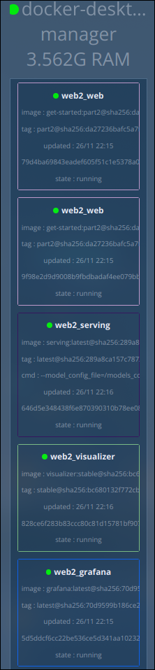
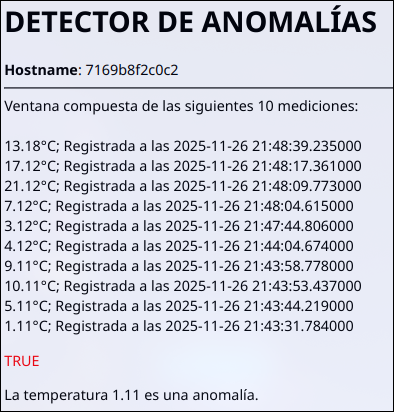
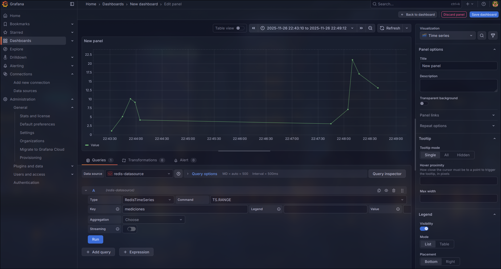

# **Memoria de Práctica: Sistemas Distribuidos y Contenedores con Docker**

Asignatura: Desarrollo de Software Crítico

Universidad de Málaga

Fecha: Noviembre 2025

---

## **1\. Introducción y Objetivos**

El objetivo principal de esta práctica es simular un sistema de monitorización industrial utilizando una arquitectura de microservicios contenerizados. El sistema aborda aspectos fundamentales del desarrollo de software crítico, tales como la tolerancia a fallos, la escalabilidad y la alta disponibilidad.

La solución implementada despliega una API REST capaz de recibir mediciones de temperatura, almacenarlas en una base de datos de series temporales (Redis TimeSeries) y detectar anomalías en tiempo real utilizando un modelo de Deep Learning servido mediante TensorFlow Serving. Todo ello es orquestado mediante **Docker Swarm**.

## **2\. Arquitectura del Sistema**

La infraestructura se ha definido utilizando un fichero docker-compose adaptado para el despliegue en stack (Swarm). Los servicios que componen el sistema son:

1. **Web (API):** Es el núcleo de la aplicación. Se han desplegado **5 réplicas** para garantizar la disponibilidad y el balanceo de carga.  
2. **Redis:** Base de datos en memoria utilizada para persistir las mediciones temporales.  
3. **Serving (TensorFlow):** Servicio dedicado exclusivamente a la inferencia de modelos de IA, desacoplando la lógica de predicción de la lógica de negocio.  
4. **Grafana:** Plataforma de visualización conectada a Redis para la monitorización gráfica.  
5. **Visualizer:** Herramienta de utilidad para inspeccionar visualmente la distribución de contenedores en los nodos del Swarm.

Todos los servicios se comunican a través de una overlay de red denominada webnet.

## **3\. Descripción de la Implementación**

### **3.1. Contenedor de la Aplicación (Dockerfile)**

Se ha creado una imagen basada en python:3.11-slim para minimizar el tamaño y la superficie de ataque.

* **Gestión de Dependencias:** Se copian e instalan las librerías listadas en requirements.txt (Flask, Redis, Numpy, Requests).  
* **Variables de Entorno:** Se definen variables críticas como `THRESHOLD` (9.233), `WINDOW_SIZE` (10) y `REDIS_HOST` para permitir la configuración dinámica sin reconstruir la imagen.

### **3.2. Lógica de Negocio (app.py)**

La aplicación Flask gestiona los siguientes puntos de entrada:

* **Conexión a Redis:** Se establece una conexión resiliente. Si Redis no está disponible, la aplicación captura la excepción RedisError para no detener su ejecución, mostrando mensajes de error controlados al usuario .  
* **Endpoints:**  
  * `/nuevo`: Recibe el parámetro dato, lo convierte a float y lo añade a la serie temporal mediciones en Redis.  
  * `/listar`: Recupera el historial de mediciones utilizando `redis.ts().revrange` y muestra el hostname del contenedor que atiende la petición, lo cual permite verificar el balanceo de carga entre las réplicas.  
  * `/detectar`: Delega el procesamiento al módulo de análisis.

### **3.3. Detección de Anomalías e Integración con TF Serving (analizar.py)**

Este módulo implementa la lógica de interacción con el modelo de Inteligencia Artificial:

1. **Recuperación de Ventana:** Obtiene las últimas `WINDOW_SIZE` mediciones de Redis. Si no hay suficientes datos, informa al usuario.  
2. **Preprocesamiento:** Formatea los datos en un array de Numpy con la forma `(1, WINDOW_SIZE, 1)` requerida por el modelo `Autoencoder`.  
3. Inferencia Remota: En lugar de cargar el modelo en la propia API (lo cual consumiría mucha memoria en cada réplica), se envía una petición POST al servicio serving en el puerto `8501`:  
   `http://{SERVING_HOST}:8501/v1/models/{MODEL_NAME}:predict`.  
4. **Decisión:** Compara el valor predicho con el real. Si la diferencia absoluta supera el `THRESHOLD`, se marca como anomalía (`TRUE` en rojo), de lo contrario es normal (`FALSE` en verde).

## **4\. Despliegue y Configuración (Docker Swarm)**

El despliegue se realiza mediante el fichero `docker-compose-serving.yml`.

### **4.1. Tolerancia a Fallos y Escalabilidad**

Se ha configurado el servicio web con las siguientes propiedades críticas para un sistema software crítico:

```YAML  
deploy:  
  replicas: 5  
  restart_policy:  
    condition: on-failure
```
Esto asegura que siempre haya 5 instancias atendiendo peticiones y que, en caso de error interno, el orquestador reinicie el contenedor automáticamente.

### **4.2. Configuración de TensorFlow Serving**

El servicio serving monta un volumen local `./models:/models` para acceder al modelo (en formato `SavedModel`) y su configuración.

## **5\. Pruebas de Funcionamiento y Evidencias**

### **5.1. Visualización del Cluster**

En la siguiente captura se observa el estado del cluster a través del servicio **Visualizer**, mostrando algunas de las 5 réplicas del servicio web y los nodos de infraestructura (Serving, Grafana). No se ve Redis y algunos otros de los nodos en favor de la legibilidad.



Fig 1\. Estado de los servicios en Docker Swarm visualizados.

### **5.2. Ingesta de Datos y Listado**

Se han realizado peticiones curl al endpoint `/nuevo` para poblar la base de datos. Posteriormente, al acceder a `/listar`, se observa la persistencia de los datos y el cambio de `Hostname` en las diferentes peticiones, evidenciando el funcionamiento del balanceador de carga interno de Docker Swarm.


### **5.3. Detección de Anomalías**

Se ha probado el sistema introduciendo una secuencia de datos estables seguida de un valor anómalo (p.ej., 80.5). El sistema consultó a TensorFlow Serving y clasificó correctamente la medición.



### **5.4. Monitorización con Grafana**

Se configuró Grafana con el plugin `redis-datasource`. A continuación se muestra el dashboard en tiempo real con la evolución de las temperaturas registradas en Redis.



Fig 2\. Visualización de series temporales en Grafana.

## **6\. Conclusiones**

La práctica ha permitido integrar un flujo completo de MLOps en una arquitectura de microservicios. Se ha comprobado cómo Docker Swarm facilita la gestión de múltiples réplicas para asegurar disponibilidad, y cómo la separación de responsabilidades (Web vs. Serving vs. Datos) crea un sistema más robusto y mantenible frente a arquitecturas monolíticas.

La utilización de volúmenes para la persistencia de datos (Grafana) y modelos (TF Serving) ha sido clave para garantizar que el reinicio de contenedores no implique pérdida de información crítica.

